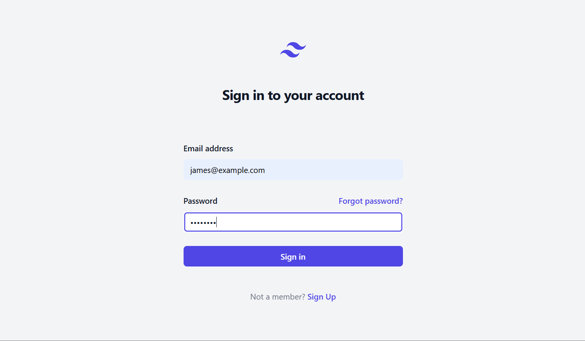
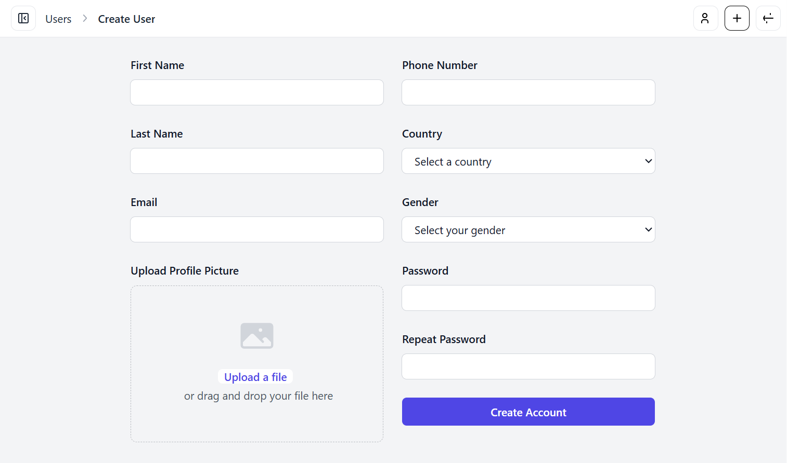
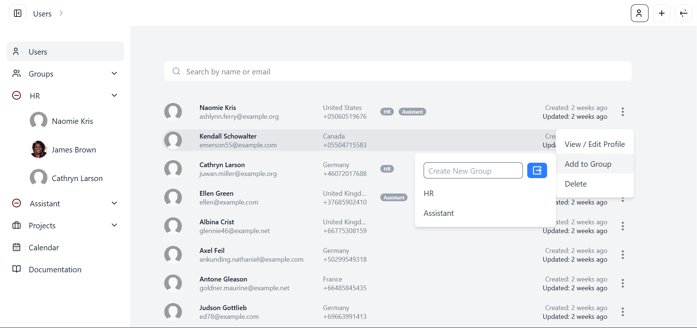
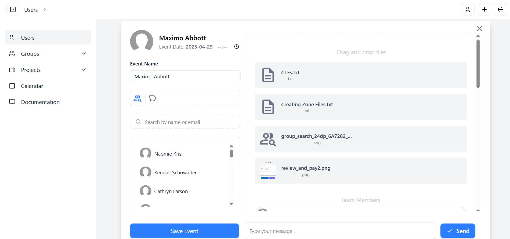

# User Management System
## DDD / EDA





---

### **Environment Setup**
These steps set up the environment variables and generate necessary keys for authentication:
```bash
cp .env.example .env
php artisan key:generate
php artisan jwt:secret
```

---

### **Install Dependencies**
Install the required dependencies for the project:
```bash
npm i
composer install
```

---

### **Setup Database**
Set up the database and populate it with initial data:
```bash
php artisan migrate
php artisan db:seed
```
```bash
Generates Users & Admin Login:
'email': admin@example.com
'password': test1234
```

(optional) seed groups
```bash
php artisan db:seed --class=GroupSeeder
```


---

### **Run The Application**
Build front-end assets and start the local development server:
```bash
npm run dev
php artisan serve
```

---

### **Start The Queue (Important)**
(required to simulate password reset link email found in storage/laravel.log):
```bash
php artisan queue:work
```

### **Start The Websocket server and client**
(For realtime calendar group messaging)
```bash
node websocket-server.js
node websocket-client.js
```

---
<br>

# Core Domain Model - User Diagram (Conceptual Flow)
.png)

### The User Service acts as the entry point for managing user-related CRUD operations. (It delegates core domain responsibilities to the User Aggregate).

### The User Aggregate enforces business rules, validates input via the DTO (UserData), and constructs the User Entity. 

### The User Entity encapsulates key aspects of user data through Value Objects such as Email, Password, Phone, Country, and Profile Picture.

<br>

### The User Service, after ensuring domain logic consistency and business rules through the User Aggregate, is then responsible for publishing domain events through the Domain Event Publisher. 

### The Domain Event Publisher broadcasts changes in the system, such as UserCreatedEvent or UserUpdatedEvent, which are then handled by Event Subscribers and Event Listeners. 

### These listeners perform actions like persisting user data to the database through the User Repository, ensuring the domain remains decoupled and reactive.


<br><br>

# System Diagram 
.png)


### This diagram shows the complete flow from a given request and emphasizes the authentication methods and modular approach of this user management system. 

<br>

### Web routes use *session-based authentication* and are handled by dedicated Web controllers for browser-based interactions:

- ### (Web) Auth Controller (Managing registration, session based *(user / admin)* authentication and login, and logout functionality)
- ### (Web) Users Controller 
- ### (Web) Admin Controller

<br>

### API routes rely on *JWT-based* authentication and feature their own set of API controllers for managing API calls:

- ### (API) Auth Controller  (Managing JWT-based *(user / admin)* authentication and login, logout functionality)
- ### (API) Users Controller
- ### (API) Admin Controller

<br>

 ### The Auth Controllers also integrates with a password reset service to handle user recovery workflows. 
 
 ### The User Service incorporates an Image Service for handling external tasks like image optimisation through conversion to webp format and for profile picture uploads. 
 
 ### The User Service, being decoupled from the application layer's controllers and the infrastructure layer, coordinates with domain constructs and external services efficiently.
 
 ### This allows integration with any additional services while maintaining scalability and modularity across the architecture. 

 ---

<br><br><br>


## Backend dev tech task
### Objective
 Demonstrate your backend development skills by implementing a basic user management system.
 
### Task Description
 Build a CRUD (Create, Read, Update, Delete) application for managing users. The system should support the following functionality:
Required User Fields (for views and forms):
Name
Surname
Email
Phone
Country (selected from a predefined list)
Gender
Password
Repeat Password (for validation)
Optional Fields (not required for current implementation):
Selfie
Introduction
Additional Requirements:
Support image upload (e.g., for a user profile picture)
Enable country selection from a predefined country list

### Acceptance Criteria
- Fork the provided Git repository and implement the task within your fork
- Implement full CRUD functionality:
- Create user
- Update user
- View user details
- View user list
- Delete user
- Follow Test-Driven Development (TDD) principles
- Apply Domain-Driven Design (DDD) best practices
- Ensure code quality, readability, and maintainability
  
### Notes:
- Your submission will be evaluated based on code quality, adherence to best practices, and completeness of the task
- Thank you and good luck!